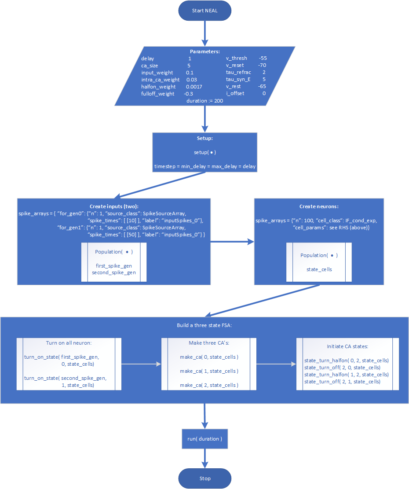
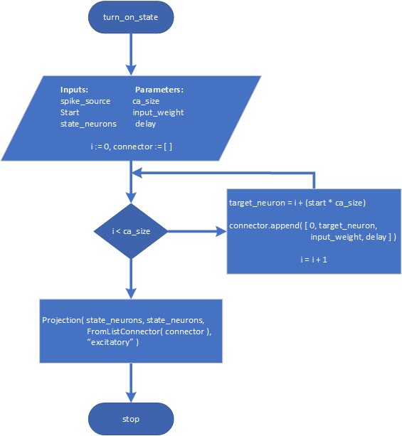
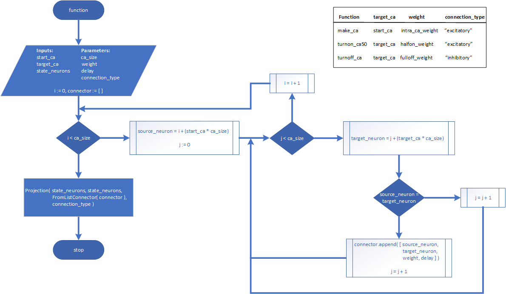

# Neuromorphic Emobodied Agents that Learn (NEAL)

## Finite-State Automaton (FSA)
[Finite-state machine or finite-state automaton](https://en.wikipedia.org/wiki/Finite-state_machine) is an abstract machine such that at any given time it can be in one of the finite number of states. In response to an external input it can transition from one state to another.

[Singh et al.](http://www.cwa.mdx.ac.uk/NEAL/code/simpleNeuralRobot.pdf) developed an FSA to control the robotic arm and grip. The FSA is based on cell assemblies of spiking neurons.

